# Personal Portfolio Website 🚀

## 📌 Project Title
Personal Portfolio Website using React

---

## 👩‍💻 About the Project
This is a single-page personal portfolio web application built using **React.js**.  
It showcases my profile, skills, projects, and contact details with a clean UI, smooth animations, and full responsiveness across devices.

This project was developed as part of **MERN Stack Internship – Task 2**, focusing on UI quality, responsiveness, and smooth user experience.

---

## 🛠️ Technologies Used
- React.js
- JavaScript (ES6+)
- HTML5 & CSS3
- Tailwind CSS
- Framer Motion
- Git & GitHub

---

## ✨ Features
- Single Page Application
- Component-based architecture
- Fully responsive (Mobile / Tablet / Desktop)
- Smooth scrolling
- Hover effects on buttons and cards
- Section animations using Framer Motion
- Dark / Light mode
- Download Resume button
- Social media links
- Contact form (UI only)

---
## 📂 Project Structure

portfolio/
├── public/
│ └── resume.pdf
├── screenshots/
│ ├── desktopview/
│ │ ├── img1.png
│ │ ├── img2.png
│ │ ├── img3.png
│ │ ├── img4.png
│ │ ├── img5.png
│ │ ├── img6.png
│ │ ├── img7.png
│ │ ├── img8.png
│ │ ├── img9.png
│ │ └── img10.png
│ └── mobileview/
│ ├── img1.png
│ ├── img2.png
│ ├── img3.png
│ ├── img4.png
│ ├── img5.png
│ └── img6.png
├── src/
│ ├── components/
│ ├── App.jsx
│ ├── main.jsx
│ └── index.css
└── README.md


## 📸 Screenshots

### 🖥️ Desktop View
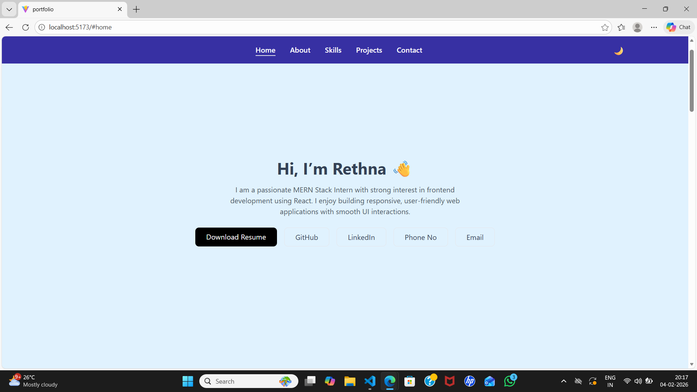
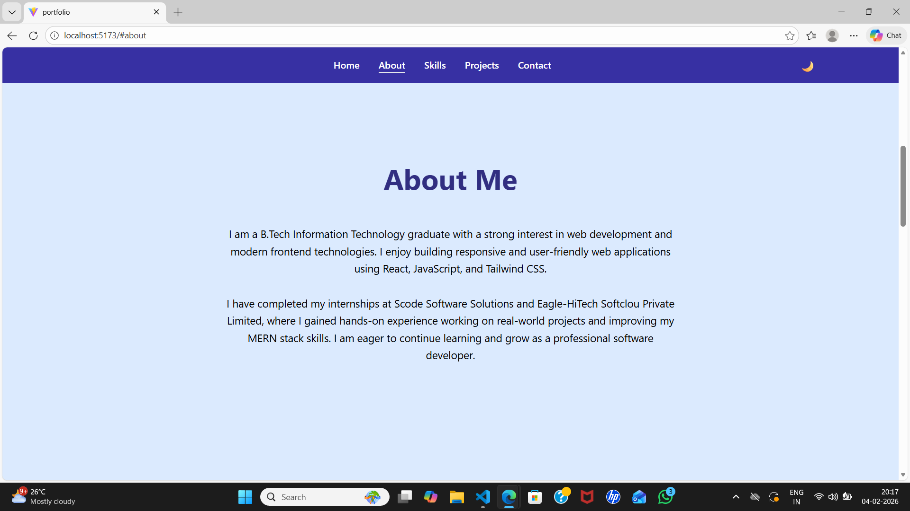
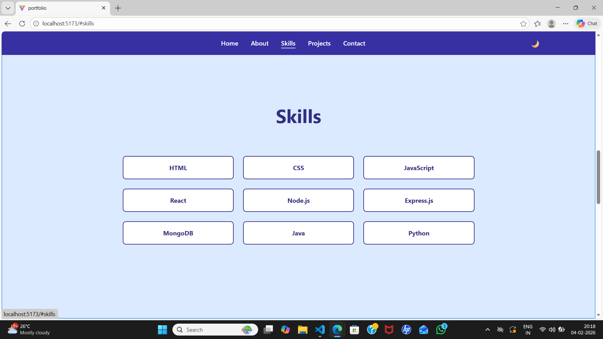
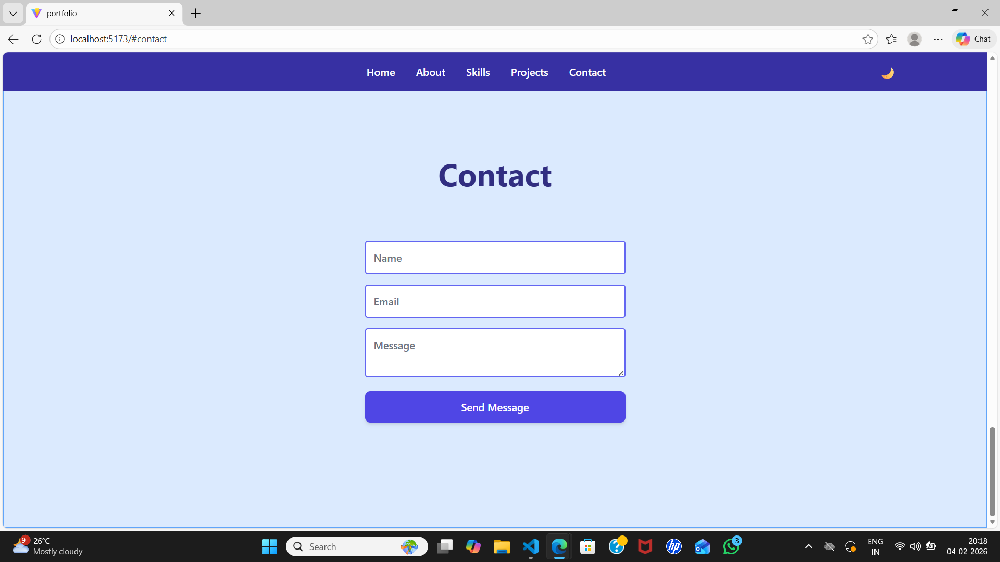
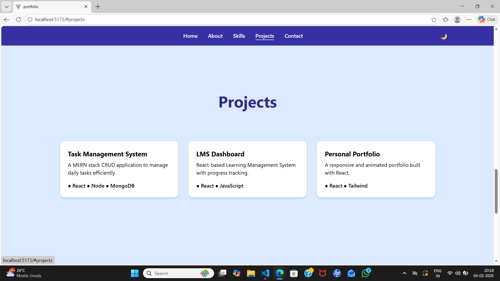
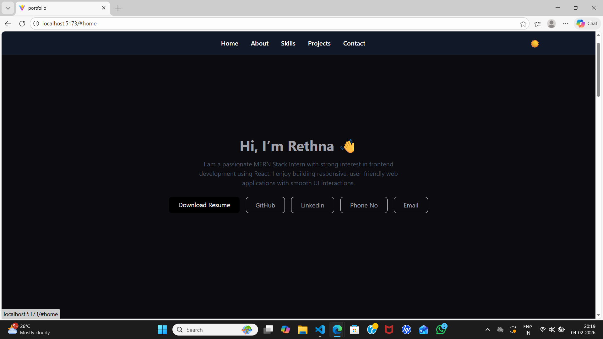
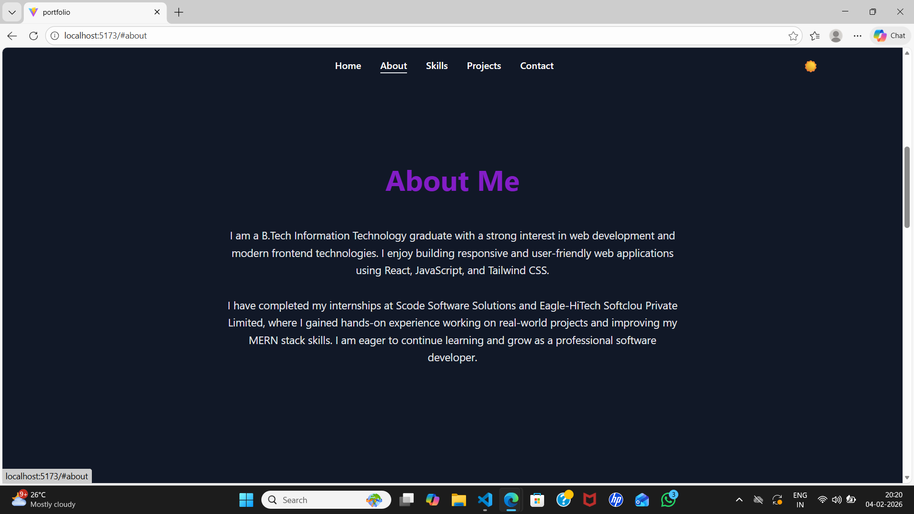
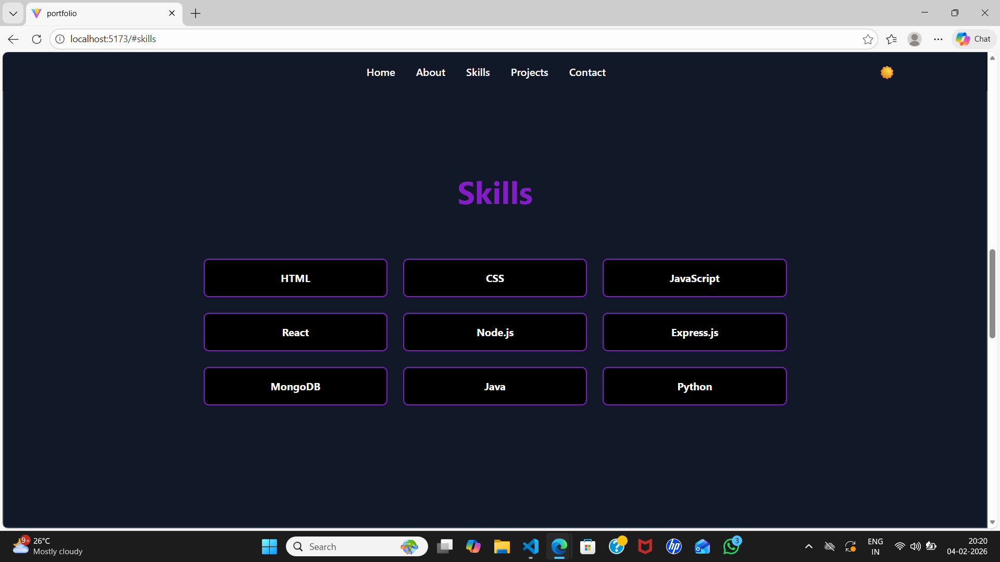
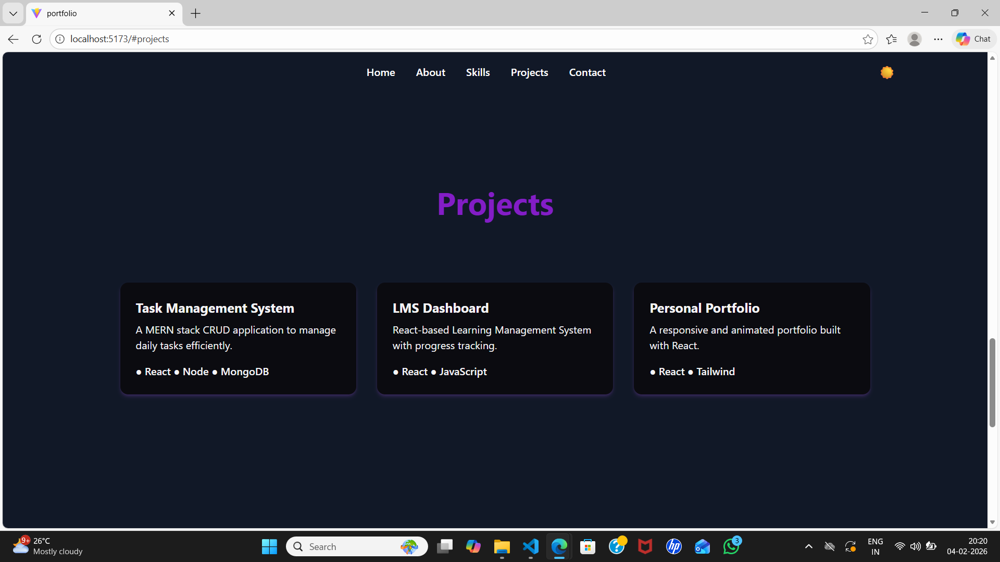
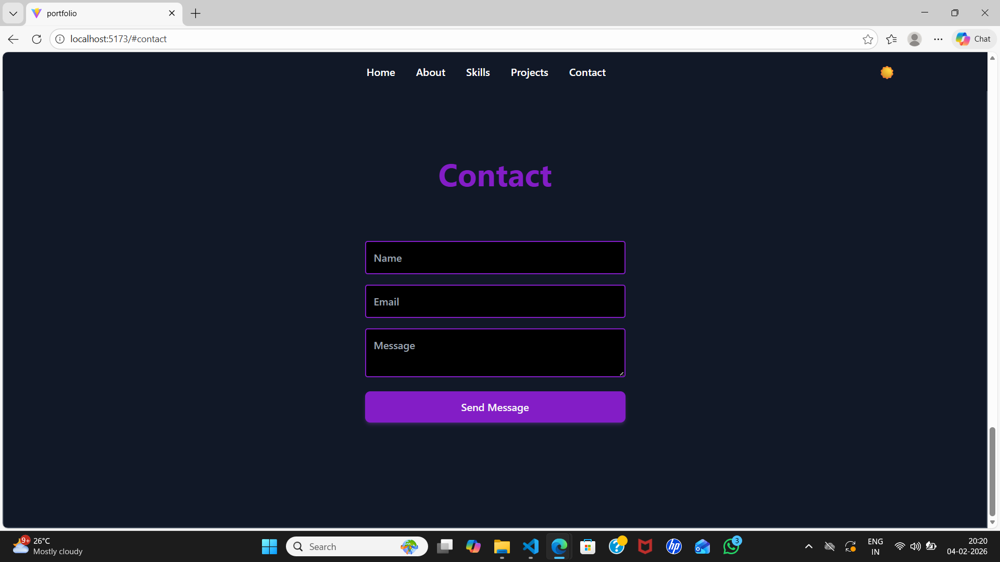

---

### 📱 Mobile View
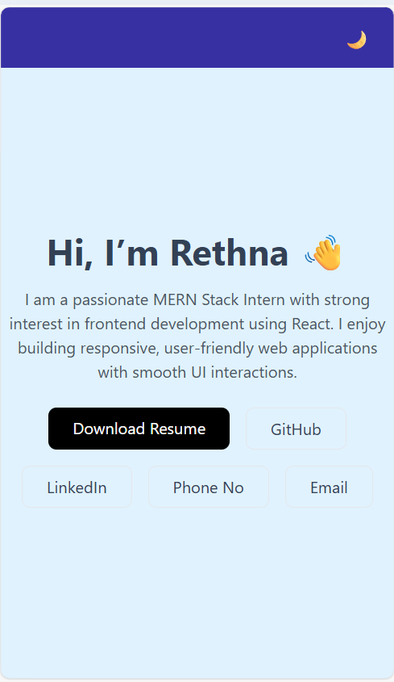
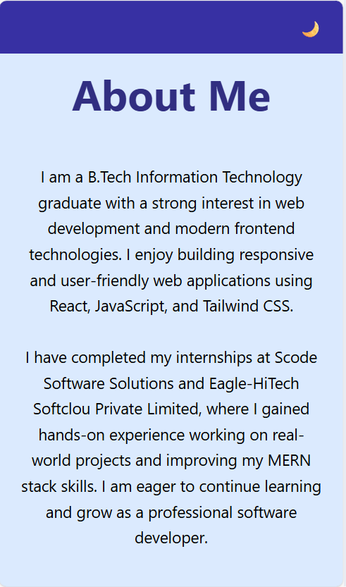
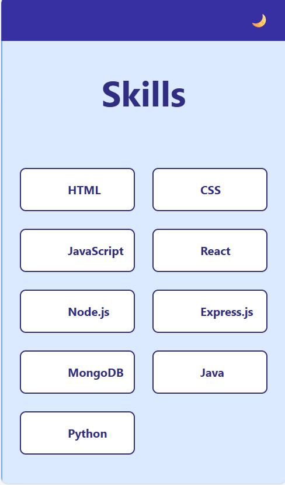
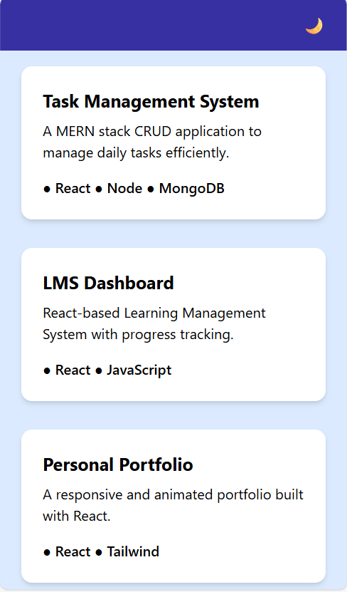
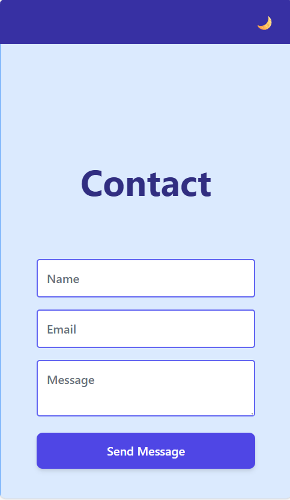
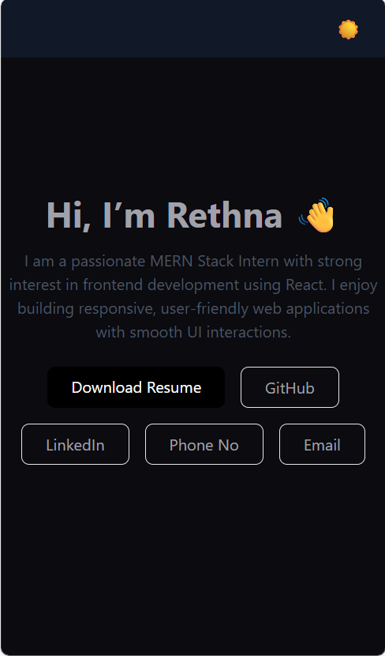

---

### 🎬 Animations
- Smooth section transitions on scroll  
- Hover effects on cards and buttons  
- Dark / Light mode toggle animation  

---


---

## 📦 Installation
```bash
git clone https://github.com/Rethna-R/portfolio


---

👩‍🎓 Author

Rethna
B.Tech Information Technology

